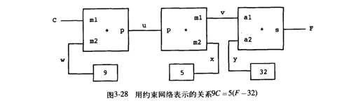

# constrain-system

constrain-system by SICP

### overview
implement basic mathematics:
- addition
- subtraction
- multiplication
- division
- square
- sqrt

and multivariate equation


### How-to-Use

Use functional expression to represent

```
9C = 5(F-32)
```

like this:

```go 
C, F := Variable("c"), Variable("f")
Multiplication(
    Params(Constant(9), C), Params(Constant(5),
    Addition(Params(Intermediate()), Params(F, Constant(-32))).GetIntermediate()))
)
```

tips: 
```
expr.GetVariable("a") // can't get variable in superior expr when target variable in inferior expr,
but can predefined the variable and then inject into expr 
```

##### Inner Structure




